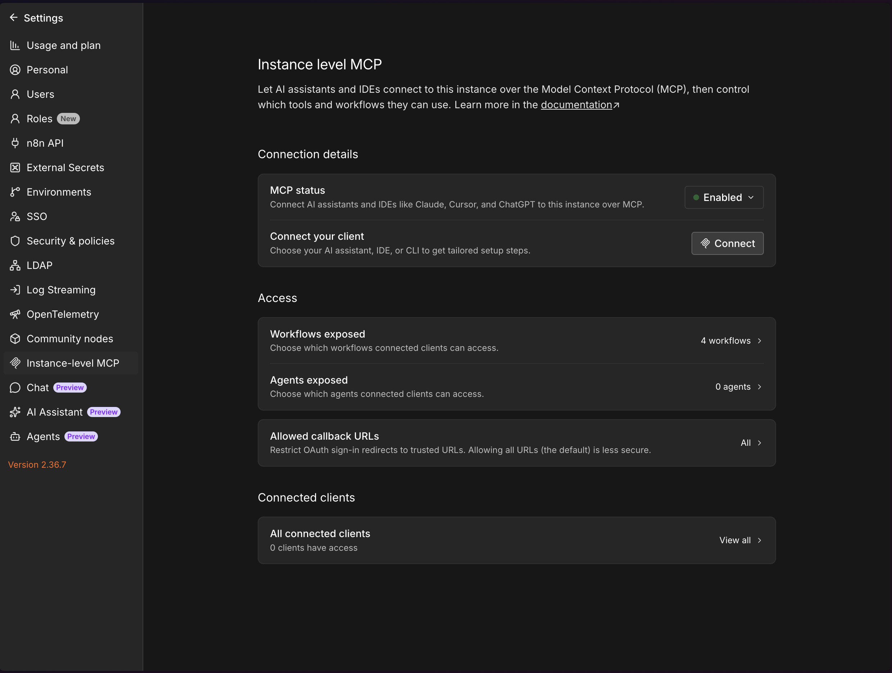
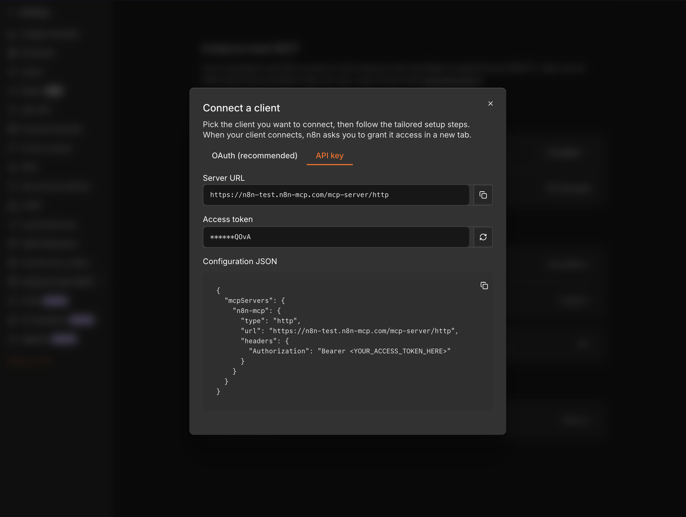

# Connecting n8n-mcp to n8n's instance-level MCP server

n8n ships its own instance-level MCP server. Giving n8n-mcp a token for it unlocks a
small set of tools that need to talk to n8n's own MCP endpoint rather than the Public
API. This page explains what that unlocks, how to get the token from the n8n UI, how
to configure it, and how to verify the connection.

## 1. What this enables

Setting `N8N_MCP_ACCESS_TOKEN` (in addition to the usual `N8N_API_URL` / `N8N_API_KEY`)
enables:

- **`n8n_manage_agents`** - create, configure, validate, and run n8n Agents (the
  persisted assistant artifact, not the AI Agent workflow node).
- **`n8n_explore_node_resources`** - resolve a node's dynamic dropdown (`loadOptions`)
  or resource-locator search (`listSearch`) values, such as Slack channels or Google
  Sheets tabs, using one of the instance's real credentials.
- The team-project fallback in **`n8n_list_catalog`** - team projects are a licensed
  (Enterprise) feature. On an instance without that licence, the Public API's
  `GET /projects` refuses the request outright; when `N8N_MCP_ACCESS_TOKEN` is
  configured, `n8n_list_catalog` then falls back to n8n's MCP server, which lists
  projects regardless of that licence gate. `n8n_manage_agents` and
  `n8n_explore_node_resources` need the token unconditionally; `n8n_list_catalog`
  works without it and only uses the token for this fallback.

**Prerequisites:**

- n8n **2.18.4 or later** for instance-level MCP itself.
- n8n **2.34 or later with the agents module enabled** for `n8n_manage_agents`.
- An **owner or admin** account on the n8n instance (instance-level MCP settings are
  admin-only).

Everything else in n8n-mcp works exactly as before without this token - it is purely
additive.

## 2. Getting the token

These steps match the n8n UI as of n8n 2.36.

1. In n8n, go to **Settings → Instance-level MCP**.
2. Set **MCP status** to **Enabled**.

   

3. Click **Connect your client → Connect**. This opens the "Connect a client" dialog.
4. In the dialog, pick the **API key** tab (not **OAuth (recommended)** - n8n-mcp
   uses a static token, not the OAuth flow).
5. Copy the **Access token** shown in the dialog.

   

   The dialog shows the token masked after the fact; the full value is only ever
   shown once, right after it is generated or regenerated. Copy it at that moment -
   the circular-arrow button regenerates the token and invalidates the previous one,
   so update your configuration if you regenerate it.

The dialog's **Server URL** field (`<your instance origin>/mcp-server/http`) is shown
for reference only. n8n-mcp derives this endpoint itself from `N8N_API_URL`, so you
only need to configure the token - not the URL, and not the "Configuration JSON"
snippet shown in the dialog (that snippet is for MCP clients that talk to n8n's MCP
server directly; n8n-mcp is not one of those clients).

## 3. Configuration

Set `N8N_MCP_ACCESS_TOKEN` next to your existing `N8N_API_URL` and `N8N_API_KEY`. This
is a separate secret from the Public API key (`N8N_API_KEY`) and should be stored the
same way - as an environment variable or secret, never committed to version control.

**Claude Desktop / Claude Code (`mcpServers` config):**

```json
{
  "mcpServers": {
    "n8n-mcp": {
      "command": "npx",
      "args": ["n8n-mcp"],
      "env": {
        "N8N_API_URL": "https://your-n8n-instance.com",
        "N8N_API_KEY": "your-n8n-api-key",
        "N8N_MCP_ACCESS_TOKEN": "your-mcp-access-token"
      }
    }
  }
}
```

**Docker:**

```bash
docker run -d \
  --name n8n-mcp \
  -e N8N_API_URL=https://your-n8n-instance.com \
  -e N8N_API_KEY=your-n8n-api-key \
  -e N8N_MCP_ACCESS_TOKEN=your-mcp-access-token \
  ghcr.io/czlonkowski/n8n-mcp:latest
```

**HTTP mode (`.env`):**

```bash
N8N_API_URL=https://your-n8n-instance.com
N8N_API_KEY=your-n8n-api-key
N8N_MCP_ACCESS_TOKEN=your-mcp-access-token
```

**HTTP mode, per request (multi-tenant):** send all three headers — `x-n8n-url`,
`x-n8n-key` and `x-n8n-mcp-token`. The Public API key is the tenant's identity for every
management tool, so a request carrying the token but no key is rejected like any other
incomplete tenant header set. `x-n8n-mcp-token` without `x-n8n-url` is rejected in any
mode: the MCP endpoint is derived from the URL. `N8N_MCP_ACCESS_TOKEN` in the
environment is never used for a header-driven request — a request whose headers carry
the URL plus a credential is authoritative and never falls back to the server's own
environment variables. All three headers are redacted from logs.

See [HTTP Deployment](./HTTP_DEPLOYMENT.md) for the rest of the HTTP-mode setup.

## 4. What the instance exposes

Back on the **Instance-level MCP** settings page, the **Access** section controls what
connected MCP clients - including n8n-mcp, once configured - can see:

- **Workflows exposed** - which workflows are visible to MCP clients. A workflow must
  be toggled on here (or have `settings.availableInMCP: true`, settable via
  `n8n_create_workflow` or `n8n_update_partial_workflow`'s `updateSettings` operation)
  before workflow-level MCP operations can act on it.
- **Agents exposed** - which agents are visible to MCP clients. Agents created through
  `n8n_manage_agents` are exposed automatically.

`n8n_manage_agents`'s `reference` and `search` actions work regardless of the Access
configuration - only actions that touch a specific agent or workflow are subject to
these toggles.

## 5. Verifying

Run `n8n_health_check` - the response includes an `officialMcp` block:

- `officialMcp.configured` - `true` once `N8N_MCP_ACCESS_TOKEN` is set.
- `officialMcp.reachable` - whether the last check reached n8n's MCP server.
- `officialMcp.toolCount` - how many tools n8n's own MCP server advertises. This is
  n8n's list, not n8n-mcp's: it depends on the n8n version and the modules enabled
  on the instance (for example, 54 on n8n 2.36 with the agents module, 39 without
  it). n8n-mcp uses that list to decide which official tools it can route to.
- `officialMcp.agentTools` - whether the agents module's tools are present (needs
  n8n 2.34+ with the agents module).

By default this reports the last cached result - on the very first call there is no
cached result yet, so `reachable` and `toolCount` are absent. Call `n8n_health_check`
with `mode: "diagnostic"` for that first check, and any time you want a fresh, live
probe instead of the cached one.

If something is misconfigured, `officialMcp.error` carries one of these codes, and
`officialMcp.hint` (or the tool's own error response) gives a one-line fix:

| Code | Fix |
|------|-----|
| `NOT_CONFIGURED` | Set `N8N_MCP_ACCESS_TOKEN` to the MCP API key from n8n Settings → Instance-level MCP → set **MCP status** to **Enabled** (a separate key from `N8N_API_KEY`). |
| `OFFICIAL_MCP_AUTH_FAILED` | The token was rejected. Regenerate it in n8n Settings → Instance-level MCP and update `N8N_MCP_ACCESS_TOKEN`. |
| `OFFICIAL_MCP_NOT_ENABLED` | n8n didn't answer as an MCP server at the derived endpoint. Enable instance-level MCP access in Settings (n8n 2.18.4+), or the instance serves MCP from a different host, which n8n-mcp doesn't support (see Limitations below). |
| `OFFICIAL_MCP_RATE_LIMITED` | n8n limits its MCP server to 100 requests per window per token. Wait and retry. |
| `OFFICIAL_MCP_TOOL_UNAVAILABLE` | This n8n instance doesn't expose the required tool. Agents need n8n 2.34+ with the agents module enabled; other tools depend on the n8n version. |
| `OFFICIAL_MCP_URL_REJECTED` | The derived MCP endpoint failed URL safety validation (a private or reserved address). Use a public instance URL, or set `WEBHOOK_SECURITY_MODE=moderate` for local development. |
| `OFFICIAL_MCP_TIMEOUT` | The request exceeded `timeoutMs`. The run continues in n8n - check `n8n_executions` for it, reuse the `sessionId` if you have one instead of re-sending, or raise `timeoutMs`. |
| `OFFICIAL_MCP_TRANSPORT_ERROR` | Could not complete the request to n8n's MCP server. Check that the instance is reachable and try again. |

## 6. Limitations

- **Split-host instances are not supported.** If your n8n deployment serves the MCP
  endpoint from a different host than the Public API (`N8N_MCP_BASE_URL`), n8n-mcp
  cannot reach it - it always derives the MCP endpoint from `N8N_API_URL`.
- **Rate limit.** n8n's MCP server allows 100 requests per window per token.
- **OAuth is not used.** The "Connect a client" dialog also offers an
  **OAuth (recommended)** tab; n8n-mcp uses the **API key** tab's static token only.
